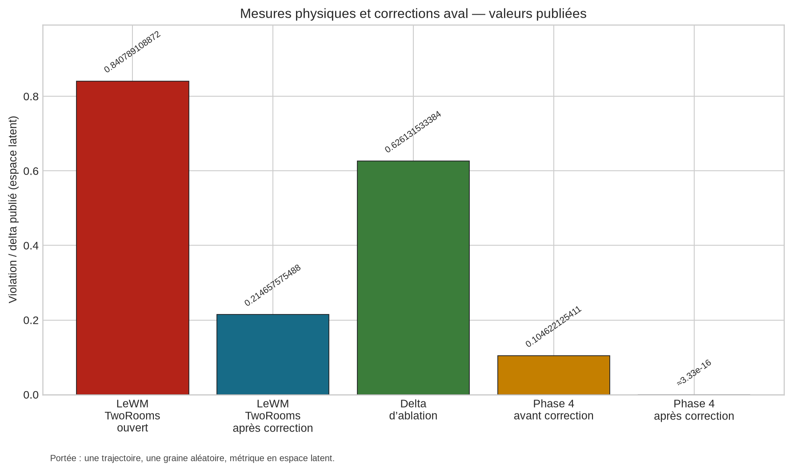
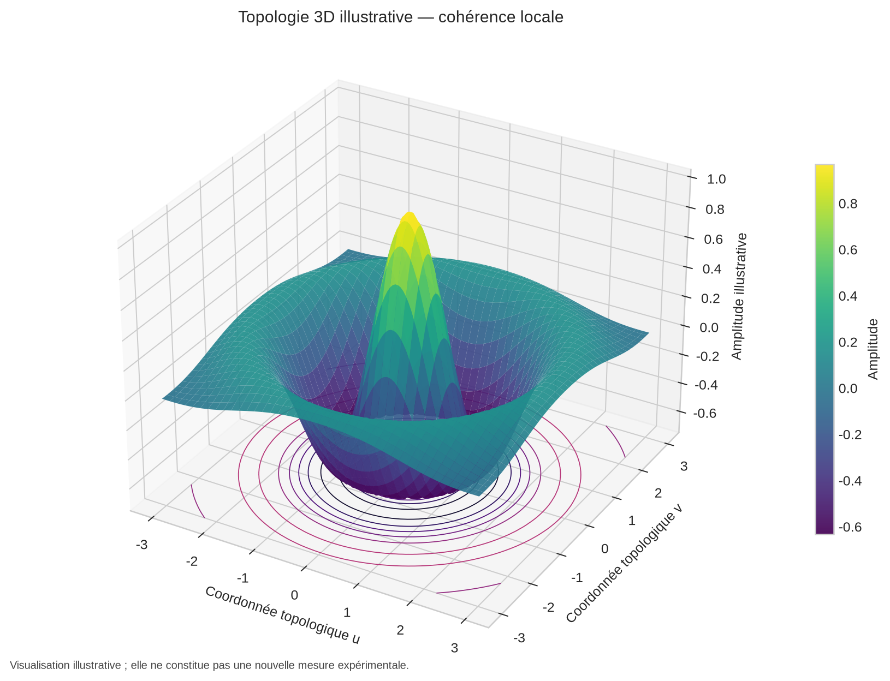
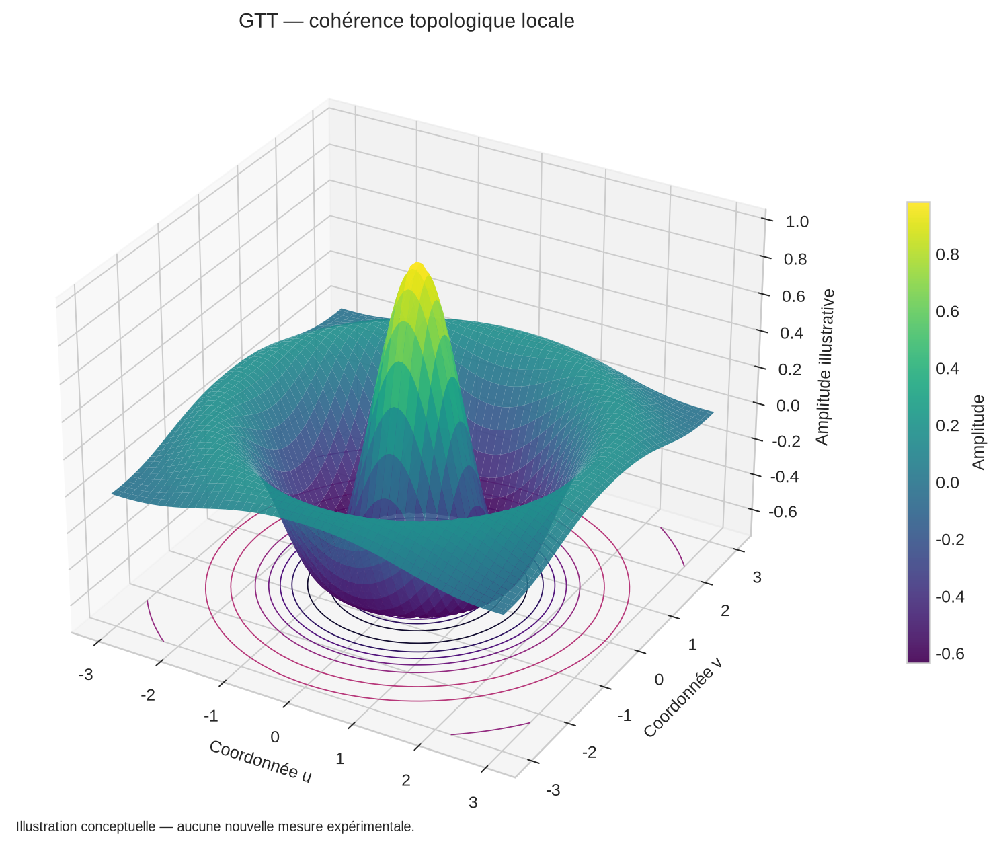
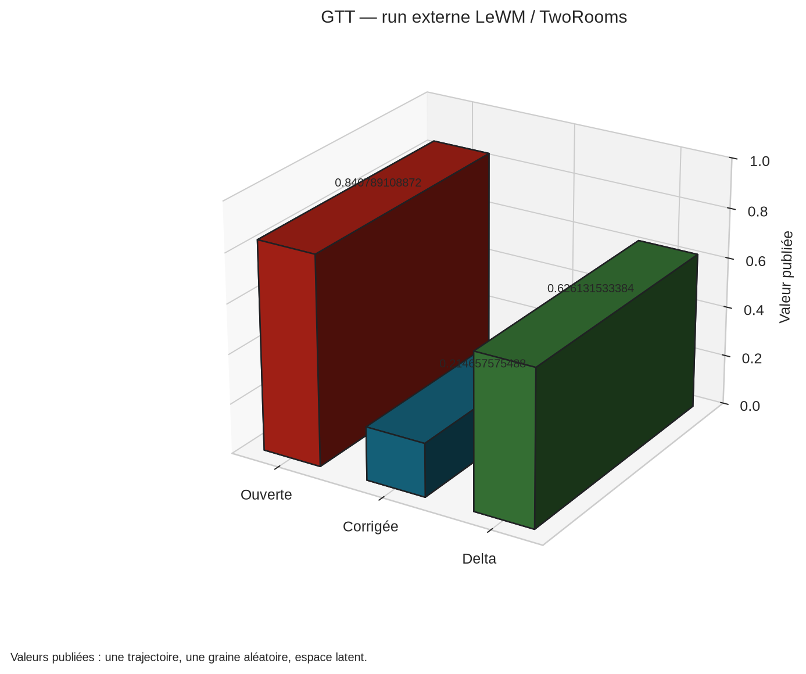
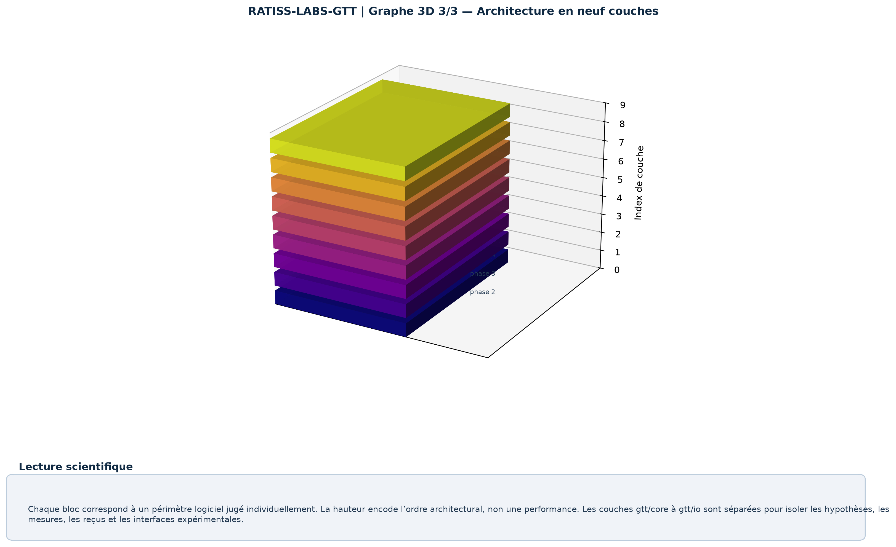

# RATISS-LABS-GTT

## Geological Topological Tech — main repository of RATISS Labs

[](https://github.com/jonathansearch/RATISS-LABS-GTT/actions/workflows/gtt.yml)
    

> **RATISS-LABS-GTT** is the main experimental platform of RATISS Labs. It provides a nine-layer architecture to measure, document and reduce invariant violations in learned world models, while keeping full traceability of parameters, executions and verdicts.


---

## 1. General presentation

RATISS-LABS-GTT, short for **Geological Topological Tech**, is an applied-research repository devoted to the reproducible audit of learned world models. The project is notably interested in models of the JEPA family (*Joint-Embedding Predictive Architecture*) and in latent models that can produce useful representations without natively respecting physical invariants, symmetries or certain causality constraints.

The repository does not claim to solve these problems definitively. It provides an instrumentation device that measures the violation, applies a downstream correction without modifying the audited model, publishes the observed delta and keeps the elements needed for an independent reproduction. This distinction between measurement, correction and claim is essential for the interpretation of the results.

The project rests on four operational principles:

1. **A mechanical layer-1 judge.** The [RATISS-Framework](https://github.com/jonathansearch/RATISS-Framework) repository is integrated as a sealed Git dependency and analyzed in continuous integration.
2. **Sealing before execution.** Parameters and manifests are frozen before execution according to rule R6.
3. **R7 reproducibility.** Every published value must be accompanied by a replayable receipt.
4. **Builder-auditor separation.** The red/blue protocol distinguishes the construction of artifacts and their audit according to rule N2.

> **Rule R7:** no published value without a third party being able to replay it in one command.

## 2. Executive summary

As of **2026-09-13**, the offline suite counts **108 successful tests**. The mechanical judge returns **exit 0**. The deterministic checks show **5 deterministic checks out of 5 compliant**. The first real external run on the official LeWorldModel, in the TwoRooms environment, measures an open-loop violation of **0.840789108872**, brought down to **0.214657575488** by downstream correction. The published ablation delta is **0.626131533384**, with an **APPROVED** verdict.

The declared scope remains strictly limited to **one trajectory**, **one random seed** and a **metric in latent space**. The independent auditor remains pending. The Lean proofs remain pending for the IBM M2 run. No generalization beyond this scope is claimed in this repository.

## 3. Verifiable results

| Measurement | Value | Verifiable source |
|---|---:|---|
| Test suite | 108 passed (standard library only) | continuous integration `gtt.yml` |
| Layer-1 mechanical judge | exit 0 (seals intact) | CI job `judge` |
| Deterministic checks | 5/5 COMPLIANT (world_models, quantum, forecast, agents, examples) | `scripts/*_check.py` |
| External run LeWM/TwoRooms — open-loop violation | 0.840789108872 | `proofs/WM-EXTERNE-LEWM-*.md` |
| External run — violation after downstream correction | 0.214657575488 | same proofs |
| Published ablation delta | 0.626131533384 — APPROVED verdict | same proofs |
| Phase 4 ablation (synthetic substitute) | 0.104622125411 then ≈3.33e-16 after correction | `proofs/PHASE4-REPLAY*.md` |
| R6 seals | 5 manifests version 0.2.0 frozen before any code (commit `9990d7e`) | `SEALS.json` |
| Independent auditor | pending — one-command replay kit | `docs/AUDIT-INDEPENDANT-KIT.md` |

These values are reproduced without modification from the artifacts present in the repository. They must be read with their experimental scope and their documented limits.

## 4. Scientific goal and limits

The long-term goal is to study the correction of physical-law violations in learned world models. This goal is a research vision and not a claim of definitive result. The repository favors cautious publication: every number must be attached to a receipt, every correction must be compared to an ablation and every limit must be explicitly kept.

The external run on LeWorldModel is executed in inference only. Gradients are disabled, the `state_dict` loading is strict and the audited model is not modified. The measured violation corresponds to the JEPA training contract itself, expressed by a relative L2 distance between the prediction and the anchored embedding. The downstream correction uses an observational anchoring of the model-predictive-control type with receding horizon, without fine-tuning.

The corresponding certification is available in [`docs/certifications/external/2026-09-13_CERT-GTT-WM-LEWM-EXT-v1.md`](docs/certifications/external/2026-09-13_CERT-GTT-WM-LEWM-EXT-v1.md). It is locked by a guardian test and remains interpreted according to the declared scope: one trajectory, one random seed and one metric in latent space.

## 5. Nine-layer architecture

The architecture is organized in nine individually evaluated layers. Each layer has its own functional scope, its tests and its traceability elements.

| Layer | Function | Status |
|---|---|---|
| `gtt/core` | topology, thermodynamics, invariants and the LCT hypothesis — local topological coherence | implemented (phase 2) |
| `gtt/quantum` | Lanczos, MPS/DMRG, T1/T2 decoherence and dry-run QPU connector | implemented (phase 3) |
| `gtt/world_models` | LEWM bridge, coherence audit, downstream correction and ablation | implemented (phase 4) + real external run |
| `gtt/forecast` | Brier/ECE calibration, sealed R5 predictions, chained journal and disarmed Metaculus bot | implemented (phase 5) |
| `gtt/agents` | orchestrator with no authority, red/blue wrappers and protocol 1.0 | implemented (phase 6) |
| `gtt/receipts` | replayable hash and receipt verification; Lean proof pending | implemented (phase 6) |
| `gtt/audit` | judge hooks, provenance and deviation journal | implemented (phase 1) |
| `gtt/viz` | isometric 3D topology in SVG, coherence atlas and DOT graph | implemented (phase 6) |
| `gtt/io` | wwPDB PDB, OSF/GitHub syncs in dry-run and token handling by environment variables | implemented (phase 6) |

The test grounds include `examples/TERRAIN-02`, based on an SIR model with exact conservation, and `examples/TERRAIN-03`, devoted to 1D Neumann heat with a decreasing stable regime, an explosive unstable regime and a documented von Neumann seed.

The frozen historical repositories are described in [`docs/ORPHELINS.md`](docs/ORPHELINS.md). This document contains **14 SHA-256 tombstones**. No code is copied and no repository is deleted as part of this preservation mechanism.

## 6. Red/blue protocol and audit governance


The orchestrator holds no decision authority. It keeps a registry and coordinates the verification flows. The red team applies the judge and publishes the raw verdicts. The blue team answers with replayable reproductions. This separation makes it possible to distinguish the production of a result from the evaluation of its compliance.

Phases 2 to 7 were built by the red team in relay, on explicit order of the laboratory chief, with full disclosure. The "independent auditor" column of each receipt remains **PENDING** according to rule N2. The external replay is performed with [`docs/AUDIT-INDEPENDANT-KIT.md`](docs/AUDIT-INDEPENDANT-KIT.md), while the public journal of audit states is kept in [`docs/AUDIT_TRAIL.md`](docs/AUDIT_TRAIL.md).

This organization does not turn a self-audit into an independent validation. It rather documents the expected separation and makes visible what remains to be verified.

## 7. Real external run and visualizations






### Three GTT 3D visualizations







> These visualizations are intended for reading and explaining the results. The numerical values of the external run come exclusively from the measurements already published in the repository.


> The 3D visualization is illustrative. The physics graph reuses exclusively the values already published in the project's proofs.

## 8. Installation and reproduction

The repository requires Python **>=3.9**. The minimal installation is the following:

```bash
git clone https://github.com/jonathansearch/RATISS-LABS-GTT.git
cd RATISS-LABS-GTT
pip install "ratiss-framework @ git+https://github.com/jonathansearch/RATISS-Framework.git"
pip install -e .
python -m pytest -q            # 108 passed (including 6 offline guardian tests)
python -m gtt.judge --ci       # exit 0 = seals intact
bash scripts/audit_independant.sh   # full replay + verdict form
```

The real external run requires heavier optional dependencies and lasts about **5 minutes**:

```bash
pip install torch --index-url https://download.pytorch.org/whl/cpu
pip install "transformers<5" stable-worldmodel einops
python scripts/wm_externe_lewm.py    # timestamped receipt in proofs/
```

The verification scripts are designed to produce inspectable outputs. Access tokens are provided by environment variables and are never displayed by the integration modules.

## 9. Repository organization

```text
gtt/            the nine layers, with a core in standard library only
examples/       TERRAIN-02, TERRAIN-03 and sealed expected.json
scripts/        deterministic checks, R7 replays and the external LeWM run
tests/          108 offline tests, including the integrity guardians
proofs/         timestamped R7 receipts and main receipts per phase
docs/           protocol, audit kit, public journal, certifications and mapping
gtt/audit/      PROVENANCE: source and commit of every line of code
```

## 10. Integrity, provenance and transparency

No value is published without a replayable receipt. No publication occurs without the laboratory chief's visa according to rule R3. The certifications of phases 2 to 7 are disclosed self-audits; the independent auditor is pending and its reproduction kit is provided.

`lean_proof` is a stub tagged **PENDING**. No Lean proof is fabricated according to rule C5. Completeness is planned during the IBM M2 run on real machine proofs.

The Metaculus bot is disarmed by construction. It runs offline, with a cap of **200 questions**, and any real submission is forbidden in the repository.

Full provenance is available in `gtt/audit/PROVENANCE.md`. The anti-copy scan of blocks of **11 lines or more** against the source repositories identified no common block.

## 11. Relationship with RATISS-Framework

[RATISS-Framework](https://github.com/jonathansearch/RATISS-Framework) constitutes the method layer and the layer-1 judge. It audits RATISS-LABS-GTT through a sealed Git dependency in continuous integration. GTT brings the nine-layer experimental ground; Framework provides the sealing, verification and decision mechanisms.

This relationship is deliberately asymmetric: layer 1 judges layer 2. GTT results must therefore not be interpreted independently of the proofs and of the verdict produced by Framework.

## 12. Laboratory and scientific responsibility

**Jonathan Evina** is founder and laboratory chief of RATISS Labs, in Yaoundé, Cameroon. He ensures the vision, the arbitration and the visa according to rule R3. His ORCID identifier is [0009-0000-4092-5313](https://orcid.org/0009-0000-4092-5313). The reference GitHub account is [jonathansearch](https://github.com/jonathansearch). The professional contact is `jonathan.ratisslabs@zohomail.com`.

The builder agents and the red team are documented in the provenance artifacts. The auditor's veto takes precedence over the laboratory chief. This rule made it possible to detect the fabrication present in internal artifacts in September 2026.

## 13. License and citation

The project is distributed under the MIT license. Copyright (c) **2026 Jonathan Evina, RATISS Labs**. The full text is in [`LICENSE`](LICENSE) and the citation information in [`CITATION.cff`](CITATION.cff).

## References

[1]: https://github.com/jonathansearch/RATISS-Framework "RATISS-Framework — executable audit protocol"
[2]: https://github.com/jonathansearch/RATISS-LABS-GTT "RATISS-LABS-GTT — main repository of RATISS Labs"
[3]: https://orcid.org/0009-0000-4092-5313 "ORCID of Jonathan Evina"

---

**The traceability of gaps and failures strengthens the credibility of published results.**
